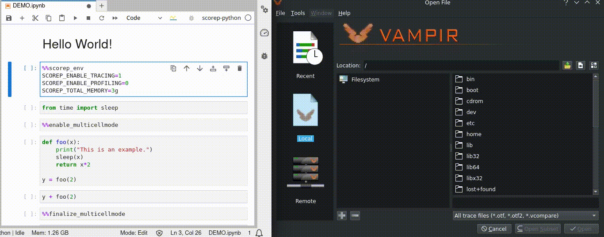

[](https://github.com/score-p/scorep_jupyter_kernel_python/actions/workflows/unit_test.yml)
[](https://github.com/score-p/scorep_jupyter_kernel_python/actions/workflows/formatter.yml)
[](https://github.com/score-p/scorep_jupyter_kernel_python/actions/workflows/linter.yml)

<p align="center">

</p>

# A Jupyter Kernel for Performance Engineering

This is the JUmPER Kernel that enables you to:

1. Monitor Jupyter cells and measure system metrics like cpu, gpu, I/O or memory utilization.

2. Instrument and trace or profile Jupyter cells with [Score-P](https://score-p.org/).

For binding to Score-P, the kernel uses the [Score-P Python bindings](https://github.com/score-p/scorep_binding_python). Monitoring does not rely on Score-P and you can use it without a Score-P installation.


# Table of Content

- [Installation](#Installation)
- [Usage](#Usage)
  * [Monitoring](#Monitoring)
  * [Score-P Instrumentation](#Score-P-Instrumentation)
  * [Multi-Cell Mode](#Multi-Cell-Mode)
  * [Write Mode](#Write-Mode)
- [Presentation of Performance Data](#Presentation-of-Performance-Data)
- [Limitations](#Limitations)
- [Future Work](#Future-Work)
- [Citing](#Citing)
- [Contact](#Contact)
- [Acknowledgments](#Acknowledgments)

# Installation

To install the kernel and required dependencies for supporting the monitoring features:

```
pip install jumper-kernel
python -m jumper.install
```

You can also build the kernel from source via:

```
pip install .
```

The kernel will then be installed in your active python environment.
You can select the kernel in Jupyter as `jumper`.

**For using the Score-P features of the kernel you need a proper Score-P installation.**

```
pip install scorep
```

From the Score-P Python bindings:

> You need at least Score-P 5.0, build with `--enable-shared` and the gcc compiler plugin.
> Please make sure that `scorep-config` is in your `PATH` variable.
> For Ubuntu LTS systems there is a non-official ppa of Score-P available: https://launchpad.net/~andreasgocht/+archive/ubuntu/scorep .


# Usage

## Monitoring

Every cell that is executed will be monitored by a parallel running process that collects system metrics for CPU, Memory, IO and if available GPU. Besides that, Jumper forwards the execution of that code to the default Python kernel.

The frequency for performance monitoring can be set via the `JUMPER_REPORT_FREQUENCY`environment variable.

```
%env JUMPER_REPORT_FREQUENCY=2
```

Additionally, the number of reports required to store performance data can be defined by the `JUMPER_REPORTS_MIN` environment variable.

```
%env JUMPER_REPORTS_MIN=2
```

The performance data is recorded in-memory and the kernel provides several magic commands to display and interact with the data:


`%%display_code_history`

Shows the history of the code of monitored cells with index and timestamp.

`%%display_code_for_index`

Shows the code for the cell of the selected index.


`%%display_graph_for_last`

Shows the performance display for the last monitored cell.

`%%display_graph_for_index [index]`

Shows the performance display for the cell of the selected index.

`%%display_graph_for_all`

Shows the accumulated performance display for all monitored cells.

`%%perfdata_to_variable [varname]`

Exports the performance data to a variable

`%%perfdata_to_json [filename]`

Exports the performance data and the code to json files.

## Score-P Instrumentation

### Configuring Score-P in Jupyter

`%%scorep_env`

Set up your Score-P environment. For a documentation of Score-P environment variables, see: [Score-P Measurement Configuration](https://perftools.pages.jsc.fz-juelich.de/cicd/scorep/tags/latest/html/scorepmeasurementconfig.html).


`%%scorep_python_binding_arguments`

Set the Score-P Python bindings arguments. For a documentation of arguments, see [Score-P Python bindings](https://github.com/score-p/scorep_binding_python).


`%%serializer_settings`

Set serializer used for persistence and mode of communicating persistence between notebook and subprocess. Currently available serializers: `dill`, `cloudpickle`; modes of communication: `disk`, `memory`. If no arguments were provided, will print current configuration. Use:
```
%%serializer_settings
SERIALIZER=[dill,cloudpickle]
MODE=[disk,memory]
```

When using persistence in `disk` mode, user can also define directory to which serializer output will be saved with `SCOREP_KERNEL_PERSISTENCE_DIR` environment variable.

`%%execute_with_scorep`

Executes a cell with Score-P, i.e. it calls `python -m scorep <cell code>`


## Multi-Cell Mode
You can also treat multiple cells as one single cell by using the multi cell mode. Therefore you can mark the cells in the order you wish to execute them.


`%%enable_multicellmode`


Enables the multi-cell mode and starts the marking process. Subsequently, "running" cells will not execute them but mark them for execution after `%%finalize_multicellmode`.

`%%finalize_multicellmode`

Stop the marking process and executes all the marked cells.
All the marked cells will be executed with Score-P.

`%%abort_multicellmode`

Stops the marking process, without executing the cells.

**Hints**:
- The `%%execute_with_scorep` command has no effect in the multi cell mode.

- There is no "unmark" command available but you can abort the multicellmode by the `%%abort_multicellmode` command. Start your marking process again if you have marked your cells in the wrong order.

- The `%%enable_multicellmode`, `%%finalize_multicellmode` and `%%abort_multicellmode` commands should be run in an exclusive cell. Additional code in the cell will be ignored.




## Write Mode

Analogous to [%%writefile](https://ipython.readthedocs.io/en/stable/interactive/magics.html#cellmagic-writefile) command in IPykernel, you can convert a set of cells to the Python script which is to be executed with Score-P Python bindings (with settings and environment described in auxillary bash script).

`%%start_writefile [scriptname]`

Enables the write mode and starts the marking process. Subsequently, "running" cells will not execute them but mark them for writing into a python file after `%%end_writefile`.
`scriptname` is `jupyter_to_script.py` by default.

`%%end_writefile`

Stops the marking process and writes the marked cells in a Python script. Additionally, a bash script will be created for setting the Score-P environment variables, Pyhton bindings arguments and executing the Python script.

**Hints**:
- Recording a cell containing `%%scorep_env` or `%%scorep_python_binding_arguments` will add the environment variables/Score-P Python bindings to the bash script.

- Code of a cell which is not to be executed with Score-P (not inside the multicell mode and without `%%execute_with_scorep`) will be framed with `with scorep.instrumenter.disable()` in the Python script to prevent instrumentation.

- Other cells will be recorded without any changes, except for dropping all magic commands.

- `%%abort_multicellmode` will be ignored in the write mode and will not unmark previous cells from instrumentation.


# Presentation of Performance Data

For the monitoring data, use the build-in magic commands or build your own visualizations after exporting the data to a variable or json via the introduced magic commands.

To inspect the Score-P collected performance data, use tools as Vampir (Trace) or Cube (Profile).

# Limitations 

## Serialization Type Support
For the execution of a cell, the kernel uses the default IPython kernel. For a cell with Score-P it starts a new Python process. Before starting this process, the state of the previous executed cells is persisted using `dill` (https://github.com/uqfoundation/dill) or `cloudpickle` (https://github.com/cloudpipe/cloudpickle/releases). However:

> `dill` cannot yet pickle these standard types:
> frame, generator, traceback

Similar yields for cloudpickle. Use the `%%serializer_settings` magic command to switch between both depending on your needs.

## Overhead

When dealing with big data structures, there might be a big runtime overhead at the beginning and the end of a Score-P cell. This is due to additional data saving and loading processes for persistency in the background. However this does not affect the actual user code and the Score-P measurements.

# Future Work

The kernel is still under development. The following is on the agenda:
 
 - Check alternative Python implementations (Stackless/PyPy) for better serialization support
 - Performance data visualizations
 - Overhead reduction (we already implemented in-memory communication for persistence handling and plan to have a parallel serializer)
 
PRs are welcome.

# Citing

If you publish some work using the kernel, we would appreciate if you cite the following paper:

```
Werner, E., Manjunath, L., Frenzel, J., & Torge, S. (2021, October).
Bridging between Data Science and Performance Analysis: Tracing of Jupyter Notebooks.
In The First International Conference on AI-ML-Systems (pp. 1-7).
https://dl.acm.org/doi/abs/10.1145/3486001.3486249
```

Additionally, please refer to the Score-P Python bindings, published here:

```
Gocht A., Schöne R., Frenzel J. (2021)
Advanced Python Performance Monitoring with Score-P.
In: Mix H., Niethammer C., Zhou H., Nagel W.E., Resch M.M. (eds) Tools for High Performance Computing 2018 / 2019. Springer, Cham.
https://doi.org/10.1007/978-3-030-66057-4_14 
```

or

```
Gocht-Zech A., Grund A. and Schöne R. (2021)
Controlling the Runtime Overhead of Python Monitoring with Selective Instrumentation
In: 2021 IEEE/ACM International Workshop on Programming and Performance Visualization Tools (ProTools)
https://doi.org/10.1109/ProTools54808.2021.00008
``` 

# Contact

elias.werner@tu-dresden.de

# Acknowledgments

This work was supported by the German Federal Ministry of Education and Research (BMBF, SCADS22B) and the Saxon State Ministry for Science, Culture and Tourism (SMWK) by funding the competence center for Big Data and AI "ScaDS.AI Dresden/Leipzig


